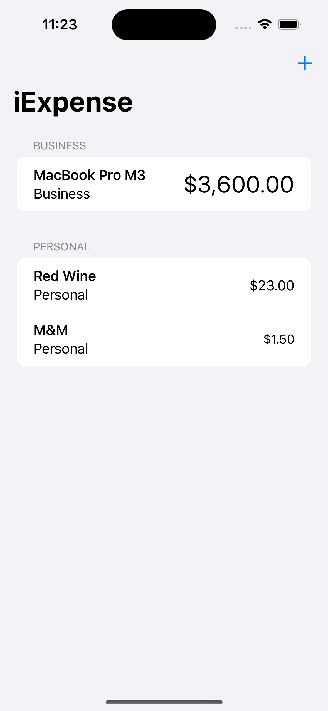
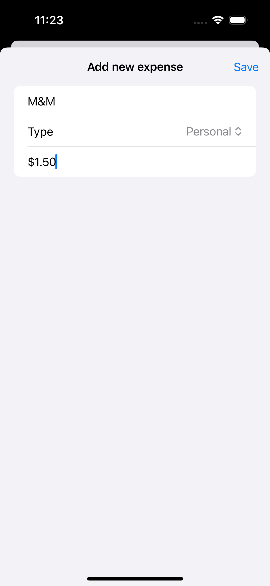
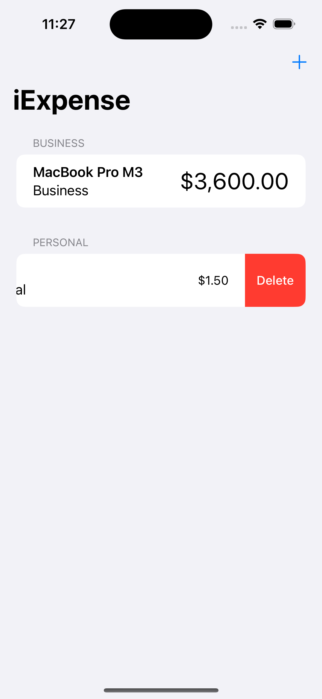

# iExpense

iExpense is a comprehensive iOS app built using SwiftUI, designed to help users track and manage their expenses efficiently. With intuitive categorization and a user-friendly interface, iExpense allows users to monitor their spending habits, categorize expenses into personal or business, and view transaction details.

    
    
    

## Features

- **Expense Tracking**: Users can log and keep track of their expenses, noting down the name, category, and amount.
- **Categorization**: Expenses are categorized into 'Business' and 'Personal' for better organization and analysis.
- **Dynamic Display**: The app dynamically adjusts the display font based on the expense amount, enhancing readability and user experience.
- **Deletion Capability**: Users have the option to delete individual expenses, allowing for accurate record-keeping.

## How to Use

1. Launch the app to view existing expenses or add new ones.
2. Tap the "Add Expense" button to input a new transaction, including its name, category, and amount.
3. Save the expense to categorize it appropriately and add it to the list.
4. Swipe to delete any expense, maintaining an up-to-date record of expenditures.

## Technologies Used

- **SwiftUI**: Utilized for building the app's interface, ensuring a seamless and responsive user experience.
- **Swift**: The programming language used for developing the app's functionality, handling data storage and manipulation.
- **Xcode**: The IDE for iOS app development, enabling the creation and testing of iExpense.

## Getting Started

To run this project locally, you'll need:

- Xcode installed on your Mac.
- Clone this repository to your local machine.
- Open the project in Xcode.
- Build and run the project on a simulator or your iOS device.

## Credits

This project is part of the ["100 Days of SwiftUI"](https://www.hackingwithswift.com/100/swiftui) course by Paul Hudson. I learned how to build this game and further develop my SwiftUI skills through the course.

## Learning Experience

In addition to following the main project instructions, I completed extra challenges provided at the end of the course where there were no instructions.
